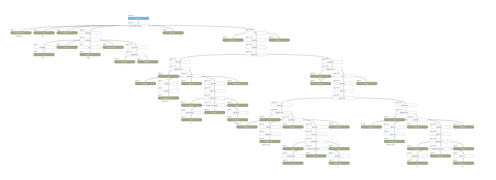

# Gert-Js Syntax Specification


This repository consist of the GJSyntax specs written in ANTLR4. 

# Usage 
Groovy
```groovy
implementation 'com.schilderschris.gjsyntax:gert-js-syntax-spec:1.0-SNAPSHOT'
```

Kotlin DSL
```kotlin
implementation("com.schilderschris.gjsyntax:gert-js-syntax-spec:1.0-SNAPSHOT")
```


# Example

Parser input:
```
component test(test: object = {}) {
    h1("Hello Gert", { id: "gert" })
    div {
        p("Hello world1", { id: "p1" })
        p("Hello world2", { id: "p2" })        
    }
}
```

Parse tree:  


