# Gert-Js Syntax Specification

This repository consist of the GJSyntax specs using ANTLR. 


# Example

Parser input:
```
component test(test: object = {}) {
    h1("Hello Gert", { id: "gert" })
    div {
        p("Hello world1", { id: "p1" })
        p("Hello world2", { id: "p2" })        
    }
}
```

Parse tree:


